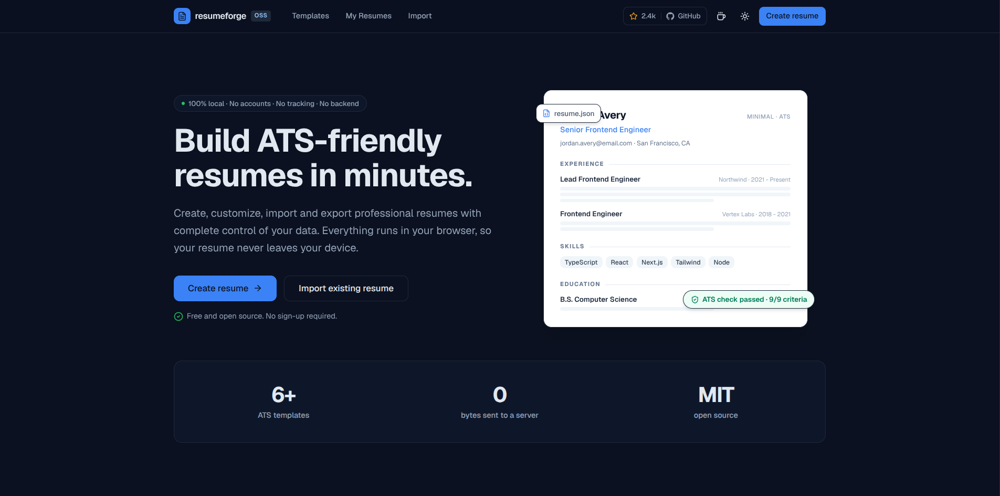
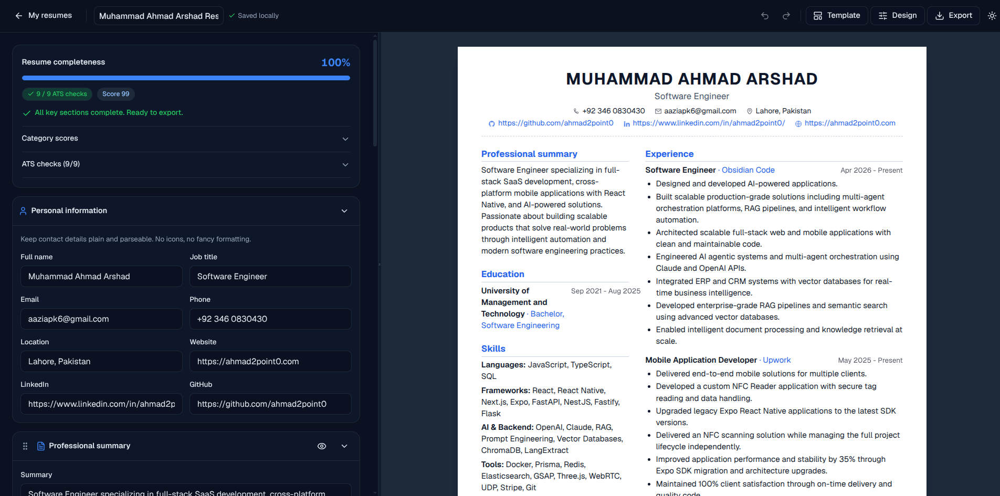
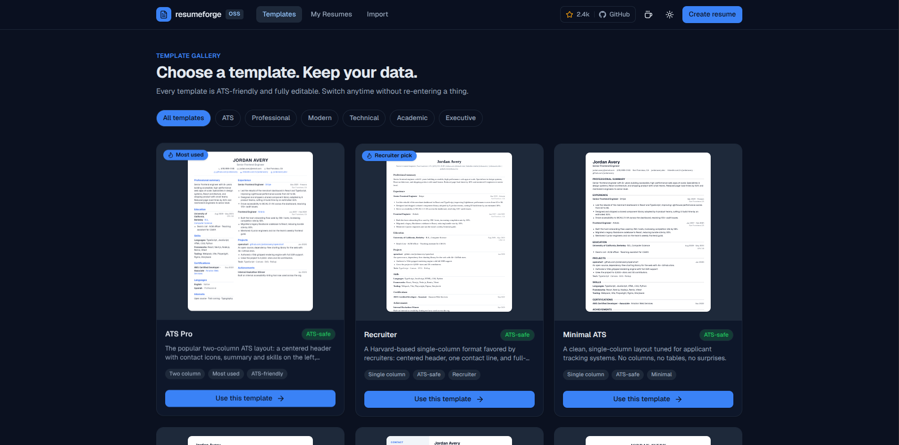
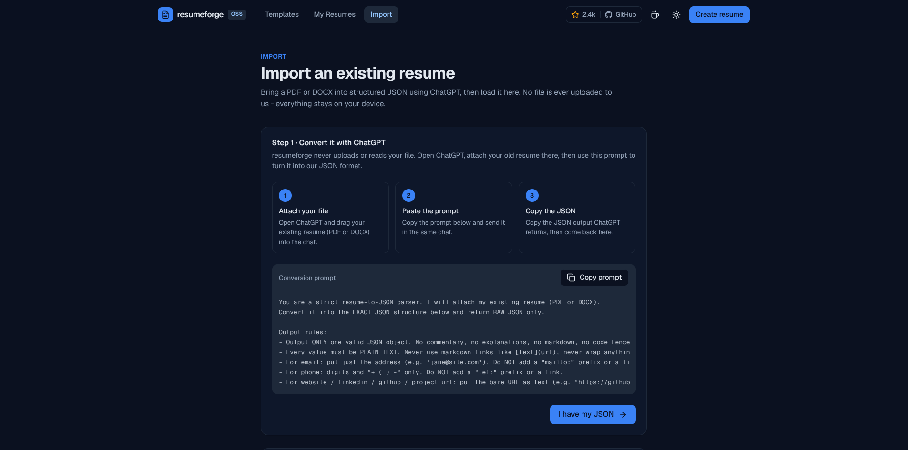

# resumeforge

> Build ATS-friendly resumes in minutes - 100% local, no backend, no account.

[](./LICENSE)
[](./CONTRIBUTING.md)
[](https://nextjs.org)
[](https://tailwindcss.com)
[](https://www.typescriptlang.org)

**resumeforge** is an open-source, AI-assisted resume builder that runs entirely in your
browser. Create, customize, import, and export professional, ATS-friendly resumes with
complete control of your data. There is no backend, no account, and no telemetry - your
resume is stored locally (IndexedDB, with a localStorage fallback) and **never leaves your
device**. The optional AI assistant uses your own API key and talks directly to the
provider from your browser.

---

## ✨ Features

### Builder
- **11 resume sections** - Professional summary, Experience, Education, Projects, Skills,
  Certifications, Achievements, Publications, Languages, Interests, and References.
- **Add, remove, reorder, and duplicate** sections and entries with **drag & drop**
  (powered by dnd-kit).
- **Live preview** that updates as you type.
- **Autosave + draft recovery**, **undo/redo**, and a clean form built on
  react-hook-form + zod validation.

### Templates
- **9 ATS-aware templates** with **instant switching**:
  ATS Pro (most used), Minimal ATS, Software Engineer, Modern Professional,
  Harvard, Startup Founder, Executive, Academic CV, and Creative.
- **Customization** per resume: accent color, font, spacing, section order, and page
  size (A4 / Letter).
- Single-column templates are flagged **ATS-safe** so you always know what a parser sees.

### Scoring
- **Real-time ATS scoring & completeness** as you edit.
- **9 ATS checks** - name & title, contact details, summary, experience, bullet points,
  quantified impact, skills, education, and ATS-safe layout.
- **5 category scores** - ATS readability, Keywords, Formatting, Experience quality, and
  Skills coverage - plus prioritized, actionable suggestions.

### Import & export
- **JSON import** to bring an existing resume in.
- A **privacy-first "convert your old PDF/DOCX" flow**: paste your old resume into
  ChatGPT (or any LLM) with the provided prompt, get clean JSON back, and import it - your
  document never touches a resumeforge server because there isn't one.
- **PDF export** for A4 and Letter: print to a PDF with **selectable text**, or download a
  **rasterized** PDF (jsPDF + html2canvas-pro).

### AI assistant (optional, bring-your-own-key)
- Opt-in assistant that runs **client-side** with **your own API key**.
- Supports **OpenAI, Anthropic, Google Gemini, DeepSeek, and Groq**.
- Requests go **directly from your browser to the provider** - the key is stored locally
  and never sent anywhere else.

### Everything else
- **Dark mode**, **keyboard shortcuts** (undo / redo / save), and **full keyboard & ARIA
  accessibility** built on Radix primitives.
- **100% local storage** - IndexedDB with a transparent localStorage fallback.

---

## 📸 Screenshots

> Screenshots are not committed yet. Drop images into `docs/screenshots/` and uncomment
> the rows below.

| View             | Preview |
| ---------------- | ------- |
| Landing          | <!--  --> |
| Dashboard        | <!--  --> |
| Builder          | <!--  --> |
| Template gallery | <!--  --> |
| Import           | <!--  --> |

---

## 🧰 Tech stack

| Area            | Technology |
| --------------- | ---------- |
| Framework       | [Next.js](https://nextjs.org) 16 (App Router, Turbopack) |
| UI library      | [React](https://react.dev) 19 |
| Language        | [TypeScript](https://www.typescriptlang.org) 5 (strict) |
| Styling         | [Tailwind CSS](https://tailwindcss.com) v4 |
| Components      | shadcn-style UI on [Radix UI](https://www.radix-ui.com) primitives |
| State           | [Zustand](https://zustand-demo.pmnd.rs) 5 |
| Forms           | [react-hook-form](https://react-hook-form.com) 7 + [zod](https://zod.dev) 4 |
| Drag & drop     | [dnd-kit](https://dndkit.com) (core, sortable, utilities) |
| PDF export      | [jsPDF](https://github.com/parallax/jsPDF) 4 + [html2canvas-pro](https://github.com/yorickshan/html2canvas-pro) 2 |
| Icons           | [lucide-react](https://lucide.dev) |
| Notifications   | [sonner](https://sonner.emilkowal.ski) |
| Theming         | [next-themes](https://github.com/pacocoursey/next-themes) |
| Storage         | IndexedDB + localStorage (custom abstraction) |
| Package manager | [Bun](https://bun.sh) |
| Linting         | ESLint 9 (`eslint-config-next`) |

---

## 🏗️ Architecture

resumeforge uses a **feature-based** structure. Application code lives in `src/` and is
split into three top-level zones:

- **`src/app`** - Next.js App Router entry points (layout, routes, global styles). Route
  files stay thin and delegate to feature modules.
- **`src/features`** - self-contained domain modules. Each feature owns its store, hooks,
  services, types, and utilities, and **features never import each other**.
- **`src/global`** - shared building blocks used across features: UI components, config,
  constants, hooks, the storage abstraction, the scoring engine, and the template engine.

```text
src/
├── app/                       # Next.js App Router (thin route files)
│   ├── layout.tsx
│   └── globals.css
├── features/                  # Domain modules (never import each other)
│   ├── ai/                    # Opt-in, bring-your-own-key AI assistant
│   │   ├── services/providers # Provider-abstracted client (OpenAI / Anthropic / …)
│   │   └── @types
│   ├── export/                # PDF export pipeline (print + rasterized)
│   │   └── @types
│   └── resumes/               # The resume editor + persistence
│       ├── hooks/             # useAutosave, useEditorShortcuts, useResumeList
│       ├── services/          # resume.repository.ts
│       ├── store/             # editor.store.ts (Zustand, undo/redo)
│       └── utils/
└── global/                    # Shared, cross-feature code
    ├── components/            # ui/ (Radix + shadcn-style) and shared/
    ├── config/                # site.ts (product identity)
    ├── constants/             # sections.ts (the section registry)
    ├── hooks/
    ├── lib/
    │   ├── scoring/           # ATS checks, category scores, suggestions
    │   └── storage/           # KeyValueStore abstraction (IndexedDB + localStorage)
    ├── templates/             # Template engine
    │   ├── components/        # Shared layouts (single / two column)
    │   ├── definitions/       # One file per template (TemplateDefinition)
    │   └── registry.ts        # Registers + looks up templates
    └── @types/
```

### Key abstractions

- **Storage abstraction** (`src/global/lib/storage`) - everything goes through a single
  async `KeyValueStore` contract. The engine resolves to IndexedDB when available and
  transparently falls back to localStorage, and is SSR-safe (no-ops on the server), so
  callers never branch on the backend.
- **Provider-abstracted AI** (`src/features/ai`) - a static provider registry describes
  each provider's base URL, models, and wire format (`apiShape: "openai"` for
  OpenAI-compatible `/chat/completions`, or `"anthropic"` for the Messages API). Only the
  user's chosen provider id, model, and key are persisted (locally). All calls run
  browser → provider.
- **Template engine** (`src/global/templates`) - each template is a `TemplateDefinition`
  (id, name, category, columns, `atsSafe` flag, default theme, and a `Renderer`
  component). Definitions are registered in `registry.ts`; renderers reuse shared
  single-column and two-column layouts. A metadata-only projection (`TemplateMeta`) powers
  the gallery.

---

## 🚀 Getting started

### Prerequisites

- **Node.js 20.9+**
- **[Bun](https://bun.sh)** (package manager and runtime)

### Install & run

```bash
# 1. Clone
git clone https://github.com/ahmad2point0/resumeforge.git
cd resumeforge/web-app

# 2. Install dependencies
bun install

# 3. Start the dev server (Next.js dev runs Turbopack by default)
bun dev
```

Open [http://localhost:3000](http://localhost:3000) in your browser.

### Scripts

| Command          | Description |
| ---------------- | ----------- |
| `bun dev`        | Start the development server (Turbopack). |
| `bun run build`  | Create a production build. |
| `bun run start`  | Serve the production build. |
| `bun run lint`   | Run ESLint. |

---

## 🔒 Privacy & data

resumeforge is **local-first by design**:

- **No backend, no account, no telemetry.** Your resume data lives only in your browser
  via IndexedDB (with a localStorage fallback).
- **Export & import** - back up or move a resume by exporting it as JSON and importing it
  on another device or browser. To migrate an existing PDF/DOCX, use the privacy-first
  flow: convert it to JSON with an LLM of your choice, then import the JSON.
- **AI keys stay local.** If you enable the optional AI assistant, your API key is stored
  on your device only, and requests go **directly from your browser to the provider**
  (OpenAI / Anthropic / Gemini / DeepSeek / Groq). resumeforge never sees your key or your
  prompts.

---

## 🗺️ Roadmap

See [ROADMAP.md](./ROADMAP.md) for the full plan. Highlights of what's planned next:

- Multi-page resume support and in-browser PDF text extraction for import.
- A cover-letter generator and a "tailor this resume to a job description" workflow.

---

## 🤝 Contributing

Contributions are welcome! Please read [CONTRIBUTING.md](./CONTRIBUTING.md) for setup
instructions, project conventions, and how to add a new template or section.

---

## 📄 License

Released under the [MIT License](./LICENSE).
